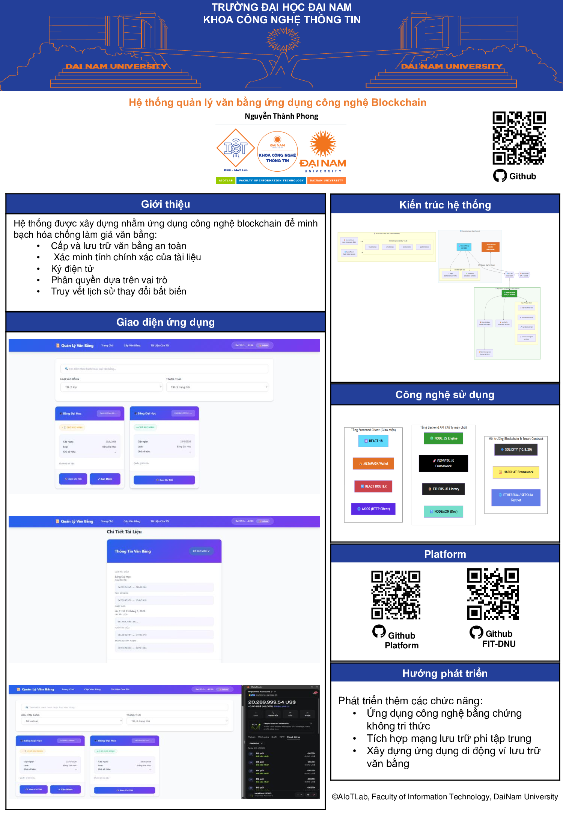

<h1 align="center">
📜 Hệ Thống Quản Lý Văn Bằng Sử Dụng Blockchain
</h1>

<hr>

<h2 align="center">✨ Mô tả dự án</h2>
<p align="justify">
  Đây là dự án <strong>HỆ THỐNG QUẢN LÝ VĂN BẰNG THÔNG MINH SỬ DỤNG BLOCKCHAIN</strong> kết hợp <strong>Smart Contracts Solidity</strong> trên nền tảng <strong>Ethereum</strong>, <strong>Backend Node.js/Express</strong>, và <strong>Frontend React</strong>. Hệ thống hỗ trợ <strong>cấp và quản lý văn bằng</strong>, <strong>xác minh tài liệu</strong>, <strong>ký điện tử</strong>, <strong>chia sẻ tài liệu</strong>, và <strong>kiểm soát quyền truy cập</strong> hoàn toàn trên nền tảng blockchain, đảm bảo tính bảo mật, minh bạch và không thể giả mạo.
</p>
<hr>

<div align="center">
  
</div>
<br>

<hr>

<h2 align="center">🚀 Cấu trúc dự án</h2>
<pre>
📂 Diploma Management System
├── 📁 blockchain/               # Smart Contracts & Deployment
│   ├── 📁 artifacts/            # Compiled contracts & build info
│   ├── 📁 cache/                # Solidity cache
│   ├── 📁 contracts/            # Smart Contract source files
│   │   └── 📄 DiplomaManager.sol # Main Smart Contract
│   ├── 📁 scripts/              # Deployment & setup scripts
│   │   ├── 📜 deploy.js         # Deploy smart contract
│   │   └── 📜 setup.js          # Setup initial data
│   ├── 📁 test/                 # Test files
│   │   └── 📄 DiplomaManager.test.js
│   ├── 📁 abi/                  # Contract ABI files
│   │   └── 📄 DiplomaManager_abi.json
│   ├── 📜 hardhat.config.js     # Hardhat configuration
│   ├── 📜 package.json          # Dependencies
│   └── 📘 README.md             # Blockchain documentation
│
├── 📁 backend/                  # Node.js/Express API Server
│   ├── 📁 abi/                  # Contract ABI
│   │   └── 📄 DiplomaManager.json
│   ├── 📁 data/                 # Temporary data storage
│   │   └── 📄 diploma_*.json    # Document records
│   ├── 📜 server.js             # Express server & API routes
│   ├── 📜 package.json          # Dependencies
│   ├── 📘 README.md             # Backend documentation
│   └── 🔑 serviceAccountKey.json # Firebase Admin (bảo mật – không chia sẻ)
│
├── 📁 frontend/                 # React Application
│   ├── 📁 public/               # Static assets
│   │   └── 📄 index.html        # HTML template
│   ├── 📁 src/                  # Source code
│   │   ├── 📁 components/       # React Components
│   │   │   ├── 📄 DocumentCard.js
│   │   │   └── 📄 Navbar.js
│   │   ├── 📁 pages/            # Page Components
│   │   │   ├── 📄 Dashboard.js
│   │   │   ├── 📄 IssueDiploma.js
│   │   │   ├── 📄 ShareDocument.js
│   │   │   ├── 📄 VerifyDocument.js
│   │   │   └── 📄 ViewDocument.js
│   │   ├── 📁 services/         # API & Blockchain services
│   │   │   ├── 📄 api.js        # Backend API calls
│   │   │   └── 📄 blockchain.js # Blockchain interaction
│   │   ├── 📁 abi/              # Contract ABI
│   │   │   └── 📄 DiplomaManager.json
│   │   ├── 📄 App.js            # Main App component
│   │   ├── 📄 config.js         # Configuration
│   │   ├── 📄 App.css           # Global styles
│   │   ├── 📄 index.css         # Global styles
│   │   └── 📄 index.js          # React entry point
│   ├── 📜 package.json          # Dependencies
│   ├── 📘 README.md             # Frontend documentation
│   └── .env.example             # Environment variables template
│
├── 📜 package.json              # Root dependencies
├── 📘 README.md                 # Project documentation
├── 📄 API_FLOW.md               # API flow documentation
├── 📄 PROJECT_STRUCTURE.md      # Project structure details
├── 📄 SETUP.md                  # Installation guide
└── 📄 WORKFLOW.md               # Workflow documentation
</pre>

<hr>

<h2 align="center">✨ Tính Năng Chính</h2>
<p align="justify">

- 📜 **Cấp Văn Bằng**: Cấp và lưu trữ văn bằng trên blockchain Ethereum
- ✅ **Xác Minh Tài Liệu**: Xác minh tính xác thực của các tài liệu bằng smart contract
- 🖊️ **Ký Điện Tử/Ký Số**: Ký tài liệu bằng chữ ký số để xác thực
- 📤 **Chia Sẻ & Hợp Tác**: Chia sẻ tài liệu với quyền hạn nhất định
- 🔐 **Kiểm Soát Quyền Truy Cập**: Cấp/thu hồi quyền truy cập cho người dùng
- 📊 **Theo Dõi Lịch Sử**: Theo dõi lịch sử thay đổi trên blockchain
- 🔗 **Tích Hợp MetaMask**: Kết nối ví Ethereum để thực hiện giao dịch
- 🛡️ **Bảo Mật Cao**: Sử dụng blockchain đảm bảo dữ liệu không thể giả mạo
- 📱 **Giao Diện Thân Thiện**: React UI dễ sử dụng cho người dùng
- ⚡ **Xử Lý Nhanh**: Node.js backend đảm bảo hiệu suất cao

</p>

<hr>

<h2 align="center">🛠️ Công Nghệ & Yêu Cầu Hệ Thống</h2>

<div align="center">

### 💻 Công Nghệ Chính

[](#)
[](#)
[](#)
[](#)
[](#)
[](#)

### 🔧 Công Cụ & Thư Viện

[](#)
[](#)
[](#)
[](#)
[](#)

</div>

<hr>

<h2 align="center">📋 Yêu Cầu Hệ Thống</h2>

### 🖥️ Phần Mềm Cần Thiết
- **Node.js**: v16.0.0 trở lên
- **npm**: v7.0.0 trở lên (hoặc yarn)
- **Git**: v2.0.0 trở lên
- **MetaMask**: Cài đặt extension trên trình duyệt

### 💾 Phần Cứng Tối Thiểu
- **CPU**: Dual-core processor
- **RAM**: 4GB trở lên
- **Storage**: 2GB trống
- **Internet**: Kết nối ổn định 5+ Mbps

<hr>

<h2 align="center">🚀 Hướng Dẫn Cài Đặt & Chạy</h2>

### I. CÀI ĐẶT CÁC CÔNG CỤ CẦN THIẾT

#### 1. Cài đặt Node.js & npm
- Tải từ: [nodejs.org](https://nodejs.org)
- Kiểm tra cài đặt: `node --version` và `npm --version`

#### 2. Cài đặt Git
- Tải từ: [git-scm.com](https://git-scm.com)
- Kiểm tra cài đặt: `git --version`

#### 3. Cài đặt MetaMask
- Tải extension MetaMask cho trình duyệt Chrome, Firefox, hoặc Edge
- Tạo wallet hoặc import wallet hiện có
- Thêm Sepolia Testnet vào MetaMask

---

### II. CHUẨN BỊ VÀ CẤU HÌNH

#### Clone Repository
```bash
git clone <repository-url>
cd diploma-management-system
```

#### Cấu Hình Environment Variables
```bash
# Tạo file .env ở thư mục gốc
cp .env.example .env

# Sửa các thông số cần thiết:
# PRIVATE_KEY: Private key của wallet (không share công khai)
# SEPOLIA_RPC_URL: RPC URL của Sepolia testnet
# CONTRACT_ADDRESS: Address của smart contract đã deploy
```

---

### III. DEPLOY & CHẠY BLOCKCHAIN

#### 1️⃣ Smart Contract (Blockchain)

```bash
# Chuyển vào thư mục blockchain
cd blockchain

# Cài đặt dependencies
npm install

# Compile smart contract
npm run compile

# Deploy lên Sepolia Testnet
npm run deploy:testnet

# Chạy test
npm run test

# (Tùy chọn) Chạy local blockchain node
npx hardhat node
```

**Sau deploy, lưu Contract Address để sử dụng ở backend và frontend**

---

### IV. CHẠY BACKEND API

#### 2️⃣ Backend API (Node.js)

```bash
# Chuyển vào thư mục backend
cd backend

# Cài đặt dependencies
npm install

# Tạo file .env
cp .env.example .env

# Chỉnh sửa .env với:
# - CONTRACT_ADDRESS: Address của smart contract
# - PRIVATE_KEY: Private key
# - SEPOLIA_RPC_URL: RPC URL

# Chạy server
npm start

# (Tùy chọn) Chế độ development với auto-reload
npm run dev
```

**API Server chạy tại**: `http://localhost:5000`

---

### V. CHẠY FRONTEND REACT

#### 3️⃣ Frontend React

```bash
# Chuyển vào thư mục frontend
cd frontend

# Cài đặt dependencies
npm install

# Tạo file .env
cp .env.example .env

# Chỉnh sửa .env với:
# - REACT_APP_CONTRACT_ADDRESS: Address của smart contract
# - REACT_APP_API_URL: URL backend API (http://localhost:5000)

# Chạy ứng dụng
npm start
```

**Frontend chạy tại**: `http://localhost:3000`

---

### VI. KIỂM TRA VÀ KIỂM THỬ

```bash
# Chạy test smart contract
cd blockchain
npm test

# Lấy testnet ETH từ Sepolia Faucet (nếu cần)
# https://sepoliafaucet.com

# Kết nối MetaMask và kiểm tra các tính năng
```

<hr>

<h2 align="center">🔑 Các Endpoint API Backend</h2>

### 📝 Quản Lý Văn Bằng
```
POST /api/documents/issue        # Cấp văn bằng mới
Body: {
  "ownerAddress": "0x...",
  "documentURI": "QmXxxx",
  "documentType": "Bachelor Degree"
}

GET /api/documents/:documentHash # Xem chi tiết văn bằng
GET /api/documents/user/:address # Xem văn bằng của người dùng
```

### ✔️ Xác Minh Tài Liệu
```
POST /api/documents/verify
Body: {
  "documentHash": "0x...",
  "isVerified": true
}
```

### 🖊️ Ký Điện Tử
```
POST /api/documents/sign
Body: {
  "documentHash": "0x...",
  "signature": "0x...",
  "role": "Issuer"
}

GET /api/documents/:hash/signatures  # Xem danh sách chữ ký
```

### 📤 Chia Sẻ Tài Liệu
```
POST /api/documents/grant-permission
Body: {
  "documentHash": "0x...",
  "granteeAddress": "0x...",
  "expiryDays": 30,
  "canView": true,
  "canVerify": false
}

POST /api/documents/revoke-permission
Body: {
  "documentHash": "0x...",
  "granteeAddress": "0x..."
}

GET /api/documents/:hash/permissions  # Xem quyền chia sẻ
```

<hr>

<h2 align="center">🧮 Smart Contract Functions</h2>

### 👑 Admin Functions
- `addIssuer()`: Thêm người cấp bằng
- `addVerifier()`: Thêm người xác minh
- `removeIssuer()`: Xóa người cấp bằng
- `removeVerifier()`: Xóa người xác minh

### 📜 Issuer Functions (Cấp Văn Bằng)
- `issueDiploma()`: Cấp một văn bằng mới
- `revokeDocument()`: Thu hồi tài liệu

### ✔️ Verification Functions (Xác Minh)
- `verifyDocument()`: Xác minh tài liệu
- `rejectDocument()`: Từ chối xác minh tài liệu
- `isDocumentVerified()`: Kiểm tra trạng thái xác minh

### 🖊️ Signature Functions (Ký Số)
- `signDocument()`: Ký một tài liệu
- `getSignatures()`: Lấy danh sách chữ ký

### 📤 Share Functions (Chia Sẻ)
- `grantPermission()`: Cấp quyền truy cập
- `revokePermission()`: Thu hồi quyền truy cập
- `hasPermission()`: Kiểm tra quyền truy cập
- `getPermissions()`: Lấy danh sách quyền

### 📋 Query Functions (Truy Vấn)
- `getDiploma()`: Lấy thông tin văn bằng
- `getUserDocuments()`: Lấy tài liệu của người dùng
- `getDocumentMetadata()`: Lấy metadata tài liệu
- `getDocumentHistory()`: Lấy lịch sử tài liệu

<hr>

<h2 align="center">🔐 Bảo Mật & Tốt Nhất</h2>

<div align="center">

| Tính Năng | Chi Tiết |
|----------|---------|
| 🔒 **Blockchain Immutable** | Dữ liệu lưu trữ trên blockchain không thể thay đổi |
| 🔐 **Smart Contract Audited** | Smart contract được kiểm tra lỗi kỹ lưỡng |
| 👤 **Role-Based Access** | Kiểm soát quyền hạn dựa trên vai trò (Admin, Issuer, Verifier) |
| 📝 **Digital Signatures** | Chữ ký điện tử để xác thực tài liệu |
| 🔑 **Private Key Management** | Private key lưu trữ an toàn trong `.env` (không commit lên Git) |
| 🛡️ **Environment Variables** | Cấu hình nhạy cảm được bảo vệ bằng `.env.example` |
| 🔄 **Transaction Verification** | Xác minh mọi giao dịch trước khi lưu trữ |
| 📊 **Audit Logs** | Ghi lại tất cả hành động trên blockchain |

</div>

<hr>

<h2 align="center">📸 Kết Quả & Demo</h2>

### Giao Diện Chính
```
Dashboard (Trang chủ)
├── Hiển thị danh sách văn bằng
├── Hiển thị trạng thái xác minh
└── Nút hành động (Cấp, Xác minh, Chia sẻ)

Cấp Văn Bằng
├── Form nhập thông tin học sinh
├── Chọn loại văn bằng
└── Nút "Cấp Văn Bằng" kết nối MetaMask

Xác Minh Tài Liệu
├── Nhập mã tài liệu/hash
├── Hiển thị trạng thái xác minh
└── Nút xác minh/từ chối

Chia Sẻ Tài Liệu
├── Chọn người dùng nhận chia sẻ
├── Cài đặt quyền (View, Verify)
└── Thiết lập hạn hữu hiệu
```

<hr>

<h2 align="center">🔧 Xử Lý Lỗi Thường Gặp</h2>

### ❌ "Contract not deployed"
- **Giải pháp**: Chạy `npm run deploy:testnet` ở thư mục `blockchain`
- Sao chép Contract Address vào `.env` của backend và frontend

### ❌ "MetaMask connection failed"
- **Giải pháp**: Kiểm tra MetaMask đã cài đặt và kích hoạt
- Đảm bảo đang kết nối Sepolia Testnet
- Có ETH testnet trong ví (lấy từ faucet)

### ❌ "Backend API connection timeout"
- **Giải pháp**: Kiểm tra backend có đang chạy (`npm start` ở thư mục `backend`)
- Đảm bảo `REACT_APP_API_URL` trong `.env` của frontend đúng
- Kiểm tra firewall không chặn port 5000

### ❌ "Insufficient balance"
- **Giải pháp**: Lấy thêm ETH testnet từ [Sepolia Faucet](https://sepoliafaucet.com)
- Có thể mất vài phút để nhận ETH

<hr>

<h2 align="center">📚 Tài Liệu Tham Khảo</h2>

- [Ethereum Docs](https://ethereum.org/developers)
- [Solidity Documentation](https://docs.soliditylang.org/)
- [Hardhat Documentation](https://hardhat.org/)
- [Ethers.js Docs](https://docs.ethers.org/)
- [React Documentation](https://react.dev/)
- [MetaMask Docs](https://docs.metamask.io/)
- [Web3 Security Best Practices](https://ethereum.org/en/developers/security/)

<hr>

<h2 align="center">🎓 Kiến Trúc Hệ Thống</h2>

```
┌─────────────────────────────────────────────────────────────┐
│                     Frontend (React)                         │
│              http://localhost:3000                           │
│  ┌──────────────┬──────────────┬──────────────┐              │
│  │  Dashboard   │ IssueDiploma │ VerifyDoc    │              │
│  └──────────────┴──────────────┴──────────────┘              │
│         │ API Calls            │ MetaMask Interaction        │
└─────────────────────────────────────────────────────────────┘
                        │                    │
                        ▼                    ▼
┌─────────────────────────────────────────────────────────────┐
│                   Backend (Express)                          │
│              http://localhost:5000                           │
│  ┌──────────────┬──────────────┬──────────────┐              │
│  │ API Routes   │ Service Tier │ Database     │              │
│  └──────────────┴──────────────┴──────────────┘              │
│         │ Smart Contract Calls   │ Data Storage              │
└─────────────────────────────────────────────────────────────┘
                        │
                        ▼
┌─────────────────────────────────────────────────────────────┐
│          Blockchain Layer (Ethereum/Sepolia)                 │
│  ┌────────────────────────────────────────┐                 │
│  │    DiplomaManager Smart Contract       │                 │
│  │  ┌──────────────┬──────────────┐       │                 │
│  │  │ Issue Diploma│ Verify Docs  │       │                 │
│  │  │ Sign Docs    │ Share/Access │       │                 │
│  │  └──────────────┴──────────────┘       │                 │
│  └────────────────────────────────────────┘                 │
└─────────────────────────────────────────────────────────────┘
```

<hr>

<h2 align="center">🤝 Đóng Góp & Hỗ Trợ</h2>

Dự án được phát triển bởi:

<table align="center">
  <thead>
    <tr>
      <th>Vai Trò</th>
      <th>Chi Tiết</th>
    </tr>
  </thead>
  <tbody>
    <tr>
      <td>📚 <strong>Hướng Dẫn</strong></td>
      <td>Giảng viên & Mentor hỗ trợ</td>
    </tr>
    <tr>
      <td>👨‍💻 <strong>Phát Triển</strong></td>
      <td>Development Team</td>
    </tr>
    <tr>
      <td>🧪 <strong>Kiểm Thử</strong></td>
      <td>QA & Testing Team</td>
    </tr>
  </tbody>
</table>

### 💡 Cách Đóng Góp

1. Fork repository
2. Tạo branch cho tính năng mới: `git checkout -b feature/YourFeature`
3. Commit thay đổi: `git commit -m 'Add YourFeature'`
4. Push to branch: `git push origin feature/YourFeature`
5. Tạo Pull Request

<hr>

<h2 align="center">📄 Giấy Phép</h2>

MIT License - Xem file [LICENSE](LICENSE) để biết chi tiết

<hr>

<p align="center">
  © 2026 <strong>Diploma Management System</strong> | 
  Built with ❤️ using Blockchain & Web Technologies
</p>

<p align="center">
  <strong>Dashboard</strong> | 
  <strong>Backend</strong> | 
  <strong>Smart Contracts</strong> | 
  <strong>Blockchain</strong>
</p>
# blc_diaploment

